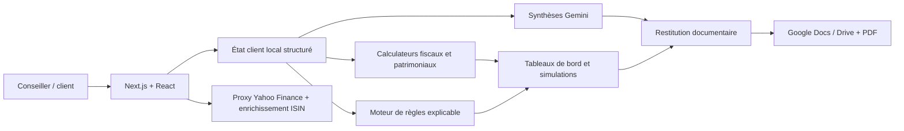

# Sparks Patrimoine

**Une plateforme web d'analyse patrimoniale qui transforme des données personnelles, fiscales et financières dispersées en diagnostics, simulations et recommandations actionnables.**

[Voir la démonstration en production](https://omet-app.vercel.app)

> Ce dépôt présente un prototype fonctionnel développé pour explorer la numérisation du conseil en gestion de patrimoine. Il ne remplace pas un conseil juridique, fiscal ou financier professionnel.

## Pourquoi ce projet ?

Un bilan patrimonial mobilise de nombreuses informations : situation familiale, régime matrimonial, revenus, charges, immobilier, placements, participations professionnelles, fiscalité et objectifs de vie. Ces données sont souvent recueillies dans plusieurs documents, puis retraitées manuellement avant de pouvoir formuler une recommandation.

Sparks Patrimoine réunit ce parcours dans une seule application :

1. collecter les informations du client de façon structurée ;
2. calculer une vision consolidée de son patrimoine ;
3. simuler plusieurs décisions civiles, fiscales et financières ;
4. détecter automatiquement les recommandations pertinentes ;
5. générer une restitution exploitable par le conseiller et son client.

Le projet combine donc **développement full-stack**, **modélisation métier**, **open data**, **intégration d'API**, **visualisation de données** et **IA générative**.

## Fonctionnalités principales

### Connaissance client

- identité, conjoint, enfants et situation matrimoniale ;
- objectifs patrimoniaux et priorités ;
- questionnaire de connaissance, capacité et tolérance au risque ;
- profil investisseur rapproché d'une échelle de risque SRI de 1 à 7.

### Vision patrimoniale consolidée

- revenus et charges par catégorie ;
- patrimoine immobilier avec valeur brute, dette, valeur nette, mode et pourcentage de détention ;
- patrimoine financier : liquidités, assurance-vie, PEA, PER, comptes-titres et autres enveloppes ;
- patrimoine professionnel avec valorisation des sociétés et répartition du capital ;
- organigramme de détention généré avec React Flow et positionné automatiquement avec Dagre ;
- tableaux de bord et graphiques de répartition.

### Fiscalité et simulations

- impôt sur le revenu : quotient familial, abattements, plafonnement, décote, CEHR et TMI ;
- IFI et calcul du patrimoine immobilier net taxable ;
- plus-value de cession immobilière, durée de détention, abattements IR/prélèvements sociaux et surtaxe ;
- droits de mutation à titre gratuit et scénarios successoraux ;
- transmission d'entreprise avec comparaison sans Dutreil, Dutreil en pleine propriété et en nue-propriété ;
- allocation financière par enveloppe et par support ;
- comparaison de statuts juridiques via le simulateur officiel de l'Urssaf.

### Moteur de préconisations

Les informations saisies sont normalisées dans un modèle client commun. Un moteur de règles déterministe évalue ensuite les conditions civiles, fiscales et financières : âge, composition familiale, régime matrimonial, montant et concentration du patrimoine, présence d'une entreprise, supports déjà détenus ou projet de transmission.

Chaque règle produit :

- une recommandation contextualisée ;
- un niveau d'urgence ;
- les avantages et points de vigilance ;
- les références juridiques utiles ;
- un impact ou un ordre de grandeur lorsqu'il est calculable.

Cette approche garde les décisions métier **explicables et auditables**. Gemini est utilisé en complément pour rédiger des synthèses adaptées au contexte client, et non pour remplacer les règles de calcul.

## Deux problèmes data intéressants

### 1. Retrouver un code ISIN à partir d'un nom de support

Les réponses de Yahoo Finance sont utiles pour rechercher un titre, récupérer son cours et son historique, mais elles ne fournissent pas systématiquement un code ISIN exploitable. Une simple recherche par ticker ne suffit pas non plus pour les fonds européens distribués sous plusieurs noms commerciaux.

La solution mise en place est une chaîne d'enrichissement côté serveur :

1. recherche du support avec `yahoo-finance2` ;
2. limitation aux trois candidats les plus pertinents pour maîtriser la latence et le quota ;
3. lancement en parallèle de recherches SerpAPI ciblées sur les résultats Investing.com ;
4. extraction d'un identifiant alphanumérique de 12 caractères depuis les extraits de résultats ;
5. normalisation et rattachement de l'ISIN au support Yahoo ;
6. possibilité de désactiver l'enrichissement avec `skipIsin` lorsque la rapidité prime.

Le proxy Next.js centralise cette logique, évite les problèmes CORS dans le navigateur et fournit un contrat de données stable à l'interface. Si l'historique Yahoo n'est pas disponible, il bascule sur une cotation instantanée au lieu de faire échouer tout le parcours.

Le même endpoint calcule aussi un indicateur de risque : il récupère jusqu'à cinq ans de clôtures hebdomadaires, annualise leur volatilité avec `√52`, puis la convertit en SRI de 1 à 7. L'allocation pondère ensuite ces SRI et les compare au profil investisseur.

### 2. Préparer une valorisation immobilière fondée sur DVF

La base **Demandes de valeurs foncières (DVF)** est une source particulièrement pertinente pour confronter une estimation immobilière aux mutations réellement enregistrées. Elle soulève néanmoins plusieurs difficultés produit : volumes importants, biens atypiques, mutations comprenant plusieurs lots, surfaces manquantes et forte dispersion locale des prix au m².

Le modèle immobilier de Sparks reprend les dimensions nécessaires à ce rapprochement : code postal, commune, surface, prix au m², valeur en pleine propriété, type de bien et évolution estimée. Dans la version actuellement publiée, le prix au m² reste renseigné par l'utilisateur et l'application calcule ensuite valeur brute, dette rattachée et valeur nette.

L'ingestion et le nettoyage automatiques de DVF constituent l'étape suivante identifiée : sélectionner des mutations comparables, écarter les valeurs non représentatives, agréger par zone et type de bien, puis conserver la provenance et la date du référentiel. Cette distinction entre **modèle prêt pour la donnée** et **pipeline effectivement livré** est volontairement explicitée ici.

## Architecture



L'application utilise l'App Router de Next.js. Les écrans interactifs s'exécutent côté client, tandis que les appels nécessitant une orchestration ou un accès tiers passent par des Route Handlers côté serveur.

Pour ce prototype, les données du dossier client sont conservées dans le `localStorage`. Ce choix permet de démontrer rapidement un parcours complet sans exposer de données personnelles à une base distante. Une version multi-utilisateur nécessiterait une authentification, une base chiffrée, une gestion fine des droits, une traçabilité des modifications et une politique de conservation conforme au RGPD.

## Stack technique

| Domaine | Technologies | Utilisation |
| --- | --- | --- |
| Front-end | Next.js 16, React 19, TypeScript | Navigation, composants client et routes serveur |
| UI | Tailwind CSS, Radix UI, Lucide | Design system, composants accessibles, thèmes clair/sombre |
| Data visualisation | Recharts, React Flow, Dagre | Répartitions patrimoniales et organigrammes de détention |
| Validation et formulaires | React Hook Form, Zod | Structure des formulaires et validation |
| Données financières | `yahoo-finance2`, SerpAPI | Recherche, cours, historique, ISIN et estimation du SRI |
| IA | Google Gemini | Synthèses patrimoniales contextualisées |
| Documents | Google Docs API, Drive API, OAuth 2.0, Puppeteer | Templates, remplacement de variables et exports PDF |
| Services publics | API Geo du gouvernement, simulateur Urssaf | Communes françaises et comparaison de statuts |
| Déploiement | Vercel | Build et mise en production depuis GitHub |

## Choix d'ingénierie

- **Règles métier séparées de l'interface** : les préconisations sont testables, lisibles et justifiables.
- **Calculs déterministes avant IA** : les montants fiscaux et les déclencheurs ne dépendent pas d'un modèle génératif.
- **Adaptateurs côté serveur** : les fournisseurs externes sont normalisés avant d'atteindre l'interface.
- **Dégradation contrôlée** : une cotation simple reste disponible si l'historique de marché échoue.
- **Calcul en temps réel** : les simulations se mettent à jour avec les entrées et peuvent être sauvegardées dans le dossier local.
- **Restitution automatisée** : les données calculées alimentent des modèles documentaires plutôt qu'un simple écran de résultat.
- **Séparation des données sensibles** : les fichiers de configuration locaux et identifiants ne doivent pas être ajoutés aux nouveaux commits.

## Ce que ce projet démontre

- traduire un domaine réglementaire complexe en modèle de données et règles exécutables ;
- construire un produit complet, de la saisie jusqu'à la restitution client ;
- intégrer des APIs hétérogènes et concevoir des mécanismes de repli ;
- arbitrer entre précision, performance, quota et expérience utilisateur ;
- rendre des calculs complexes compréhensibles grâce à la visualisation ;
- distinguer clairement les fonctionnalités livrées des évolutions encore prévues.

## Lancer le projet

```bash
npm install
npm run dev
```

L'application est ensuite disponible sur `http://localhost:3000`. Les fonctions de marché, d'IA et d'export nécessitent des accès aux services tiers correspondants.

## Structure du dépôt

```text
app/                         Écrans et Route Handlers Next.js
  api/                       Yahoo Finance, Gemini, Google Drive et exports
  fiscalite/                 Impôt sur le revenu et IFI
  patrimoine/                Immobilier, financier et professionnel
  simulations/               Allocation, cession, DMTG, Dutreil et statuts
lib/                         Calculateurs et moteur de préconisations
components/                  Design system et navigation
docs/                        Documentation détaillée des règles métier
templates/                   Modèles de restitution patrimoniale
```

## Améliorations prévues

- ingestion, normalisation et cache des données DVF ;
- migration du stockage local vers une base chiffrée multi-utilisateur ;
- authentification et gestion des rôles conseiller/client ;
- tests unitaires des barèmes et tests end-to-end des parcours critiques ;
- versionnement des règles fiscales par année ;
- observabilité des appels externes et suivi des quotas ;
- internationalisation et accessibilité renforcée.

---

**Auteur : [michaelspot](https://github.com/michaelspot)**

Projet de démonstration orienté fintech, gestion de patrimoine et automatisation du conseil.
